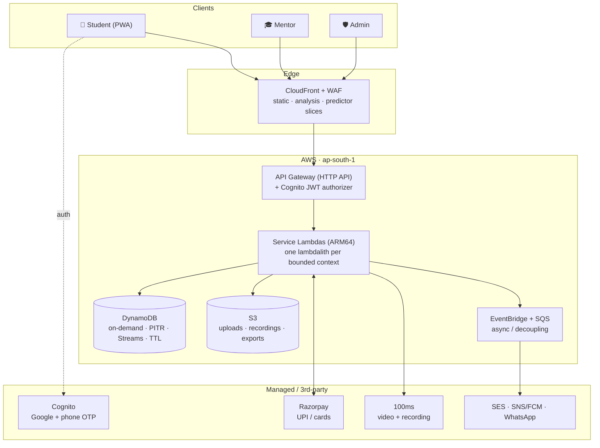

# 🎓 Student‑Counselor — JEE / JoSAA Counselling Platform

> **Predict → Plan → Talk.** A rank‑to‑seat companion for the ~8‑week JEE/JoSAA counselling window, built to sit idle at **≈ $0** for ten months and absorb **lakhs of students in minutes** when a round result drops.

<p>
  
  
  
  
  
  
</p>

---

## 📖 Table of contents

- [In one paragraph](#-in-one-paragraph)
- [Who it's for](#-whos-it-for-three-audiences-one-app)
- [What it can do — the full feature tour](#-what-it-can-do--the-full-feature-tour)
- [The 60‑second architecture](#-the-60second-architecture)
- [The AWS flex — every service and why it's here](#-the-aws-flex--every-service-and-why-its-here)
- [The nine bounded contexts (microservices)](#-the-nine-bounded-contexts-microservices)
- [Why this scales to lakhs (and stays near‑free)](#-why-this-scales-to-lakhs-and-stays-nearfree)
- [Data model](#-data-model)
- [Security, privacy & safety](#-security-privacy--safety-many-users-are-minors)
- [Cost model](#-cost-model--engineered-to-run-nearfree)
- [Observability & operations](#-observability--operations)
- [Repository layout](#-repository-layout)
- [Tech stack](#-tech-stack)
- [Getting started (local)](#-getting-started-local)
- [Deploying to AWS](#-deploying-to-aws)
- [API surface](#-api-surface)
- [Build status by phase](#-build-status-by-phase)
- [Live environment](#-live-environment-dev)
- [Data attribution & disclaimer](#-data-attribution--disclaimer)

---

## 🧭 In one paragraph

Every year ~1.5 million students take JEE and then face **JoSAA counselling** — a high‑stakes, multi‑round process where you order a list of college‑branch choices and an algorithm allots you a seat. Get the list wrong and you lose a year. **Student‑Counselor** turns that guesswork into a guided flow:

1. **Predict** — type your rank, get your reachable colleges sorted into **Safe / Target / Reach**, computed over **11,261 official JoSAA 2024 cutoffs across 121 institutes** (23 IITs + 31 NITs + IIITs + GFTIs), with your **home‑state quota** advantage applied automatically.
2. **Plan** — drag those colleges into an **ordered choice list**, and a server‑authoritative **"List Doctor"** flags the classic mistakes (no safe options, too few choices, a reach‑heavy top, duplicates) before you lock it in.
3. **Talk** — book a **paid 1:1 video call** with a verified senior at your dream college to sanity‑check the plan.

Under the hood it's a **serverless AWS backend** (Lambda + API Gateway + DynamoDB + CloudFront + Cognito) plus a **Next.js** frontend — architected around one brutal constraint: the product is **seasonal, spiky, and read‑dominated**, so it must cost almost nothing when idle and survive a **100× traffic cliff** the moment a result publishes.

---

## 👥 Who's it for — three audiences, one app

| Role | What they do | Where |
|---|---|---|
| 🎒 **Student** | Predict colleges, build & doctor a choice list, browse mentors, book & attend paid sessions, track deadlines | `dashboard`, `predictor`, `shortlist`, `choiceBuilder`, `marketplace`, `sessions` … |
| 🎓 **Mentor** (verified senior) | Apply + get verified (`.ac.in` OTP + ID), set availability & price, run sessions, earn payouts | `mDashboard`, `mVerification`, `mAvailability`, `mEarnings` … |
| 🛡️ **Super Admin** | Approve mentors, moderate, manage college data, run broadcasts, watch dashboards, handle support | `aDashboard`, `aVerifyQueue`, `aCollegeData`, `aBroadcast`, `aAnalytics` … |

The frontend ships **~70 screens** across these four contexts (marketing, student, mentor, admin) plus a system set (empty/loading/error/confirmation states).

---

## ✨ What it can do — the full feature tour

### 🔮 Predict — the college predictor *(the hottest path)*
- Enter **rank + category + home state + filters** → get college‑branches bucketed **Safe / Target / Reach** with a per‑result **chance %**.
- Runs over **real, official JoSAA 2024 data** — opening & closing ranks per **category / quota / gender‑pool**, for every institute type.
- **Home‑State (HS) quota** is applied automatically: the engine picks the **All‑India** row, else the **home‑state** row when the institute is in your state (the real HS advantage, flagged `homeQuota`), else **Other‑State**.
- Correct exam mapping — **IITs → JEE Advanced rank**, NITs/IIITs/GFTIs → **JEE Main rank**.
- Enriched result cards: **city, state, NIRF rank, approximate fees**, quota badge, and a **"Live · official JoSAA"** trust badge.
- **Predictions are public and shareable** → they're **cacheable at the CDN edge**, so millions of identical "rank 850, Open, Maharashtra" requests collapse onto one cached answer.
- The math is **documented** (`backend/docs/prediction-algorithm.md`) and **locked by tests** (rank 850 → 12 Safe / 3 Target / 3 Reach).

### 🧩 Plan — the choice‑list planner *(core)*
- **Shortlist** the colleges you like, then drag them into an **ordered choice list** (order = your JoSAA priority).
- **List Doctor** runs on the **server** (authoritative — the app and the API can't disagree) and warns on: **no safe option**, **too few choices**, **reach‑heavy top**, **duplicates**.
- **Optimistic concurrency** — every save carries a `version`; a stale write (two tabs, a double‑tap) gets a clean **409** instead of silently clobbering your list.
- **Export to PDF** for offline reference / filling on the JoSAA portal.

### 🗣️ Talk — mentors, booking, payments & video *(core)*
- **Marketplace** of verified seniors — search/filter by **college, branch, topic, price, rating, soonest slot**.
- **Mentor verification** is the trust gate: `.ac.in` **email OTP** + **student‑ID upload** → `PENDING_REVIEW` → admin approve/reject; college/branch/year lock after approval.
- **Booking ↔ Payment saga** — a slot is held (`PENDING_PAYMENT`, auto‑released by TTL), a **Razorpay** order is created, and only a **signature‑verified webhook** confirms the booking. **Idempotency keys** everywhere; money truth lives in an **append‑only ledger**.
- **Video sessions** on a managed WebRTC SFU (**100ms**) — the Lambda only mints a **join token**; media never touches our compute. Recording captured to **S3** for safety.
- **Ratings**, **receipts**, **refunds** (auto‑refund on mentor no‑show), and **mentor payouts** (₹80 of ₹100 after platform fee).

### 🔔 Timeline & notifications
- **Event‑driven** reminders off the counselling calendar (e.g. *"Round 2 choice‑filling closes in 24h"*).
- Booking/mentor updates + **admin broadcasts** (segment by state / round) across **in‑app, email (SES), push (SNS/FCM), WhatsApp**.

### 🛡️ Admin & ops console
- **Verification queue**, **moderation** (trust & safety, extra care for minors), **CMS/content**, **college‑data management**, **support tickets**.
- Dashboards read from **materialized rollups** (never scan live tables); every admin action is **audited** to an append‑only log.

---

## 🏗️ The 60‑second architecture



**The caching ladder — a read climbs down only as far as it must:**

```
Client ─▶ CloudFront (edge cache)        ← ~90%+ of Analysis & popular predictor slices stop HERE
        └▶ API Gateway ─▶ Lambda
                          ├▶ Lambda memory snapshot (warm)   ← the cutoff dataset, zero network
                          └▶ DynamoDB (source of truth)      ← personalized / uncacheable only
```

**Design stance, one line:**
> **Serverless‑first, cache‑hard, compute‑not‑query** — with managed services for the two things Lambda is bad at (video media and heavy SQL analytics).

---

## ☁️ The AWS flex — every service and why it's here

This is an **all‑AWS, serverless‑native** build. Nothing runs 24×7; everything scales to zero.

| AWS service | Role in this system | Why it wins here |
|---|---|---|
| **AWS Lambda** (Node 20 on **ARM64 / Graviton**) | All compute — one **lambdalith per bounded context** (Hono router) | Scale‑to‑zero for 10 idle months; elastic to 100× spikes with **no capacity planning**; Graviton = cheaper + faster cold start |
| **Amazon API Gateway** (HTTP API) | The front door; **Cognito JWT authorizer** validates tokens at the edge before code runs | Pay‑per‑request, no idle cost; auth offloaded from app code |
| **Amazon Cognito** | Sign‑up/in via **Google + phone OTP**, JWT issuance, `custom:role` claim (student/mentor/admin) | Managed identity, free at current scale (with a documented $0 migration path to Firebase/Google‑direct at lakhs‑MAU) |
| **Amazon DynamoDB** (on‑demand) | Primary datastore — **per‑service tables**; **PITR** backups, **Streams** for events/rollups, **TTL** for slot holds & OTPs | Scales to **zero and to lakhs** with no connection layer; single‑digit‑ms reads; on‑demand = no idle spend |
| **Amazon CloudFront** | CDN for static assets, **College Analysis pages**, and **predictor result slices** (`s‑maxage` + `stale‑while‑revalidate`) | **1 TB egress always‑free**; absorbs the spike so origin sees a rounding error |
| **AWS WAF** | Edge protection + rate limiting (feature‑flagged `enableWaf`, on for prod hardening) | Sheds abusive/bot load; kept **off** off‑season to stay near‑$0 |
| **Amazon S3** | Uploads (mentor IDs), **session recordings**, PDF exports, dataset import files | Pennies/GB; lifecycle‑managed retention for privacy (DPDP) |
| **Amazon EventBridge** | The event backbone — `booking.confirmed`, `mentor.approved`, `user.role_changed`, deadline schedules | Decouples services; **EventBridge Scheduler** fires deadline reminders & seasonal ramp jobs |
| **Amazon SQS** (+ DLQ) | Load‑levels booking/payment/notification bursts; retries + dead‑letter | Smooths spikes into a drainable queue; nothing dropped |
| **AWS Step Functions** | Cutoff‑dataset **validate → stage → publish** pipeline (schema, sanity, diff vs previous) | Reliable multi‑step ingestion without a 15‑min Lambda cap problem |
| **Amazon SES / SNS / FCM** | Email, push, SMS/alerts — the notification channels | Managed, pay‑per‑send fan‑out |
| **Amazon Athena** | Serverless SQL over **DynamoDB Streams → S3** for funnel/revenue/cohort analytics | Query‑in‑place, **scales to zero**, no Aurora idle cost |
| **Amazon CloudWatch** | Structured JSON logs, **dashboards** (API/Lambda/DDB), **alarms → SNS email** (5xx, Lambda errors, throttles, p95) | Single pane of glass; alarms treat missing data as *not breaching* (quiet ≠ paging) |
| **AWS X‑Ray** | Distributed tracing API GW → Lambda → DynamoDB | Root‑cause latency across the request path |
| **AWS Budgets** + **Cost Anomaly Detection** | A **$10/mo** guardrail emailing at 50/80/100% | Unit‑economics discipline — *cost per 100k predictions*, *cost per paid session* |
| **AWS Secrets Manager** | Razorpay keys, Google OAuth client secret | No secrets in code; least‑privilege reads |
| **AWS KMS** | Encryption at rest + field‑level for sensitive IDs | DPDP‑aligned data protection |
| **AWS Amplify Hosting** | Hosts the **Next.js** frontend (CloudFront‑backed, auto‑SSL, custom domain) | One‑command deploy of the static export; free tier |
| **AWS CDK** (TypeScript) | **All infrastructure as code** — per‑service stacks, per‑env config, diffable & reviewable | Reproducible envs; `cdk deploy` = the whole platform |
| **AWS IAM** | **Per‑service, table‑scoped, least‑privilege** roles (e.g. planner gets RW planner + **read‑only** catalog) | Blast‑radius containment |

> **Managed 3rd‑party** (deliberately off‑AWS where a specialist wins): **Razorpay** (UPI‑first payments), **100ms** (India‑low‑latency video SFU; Amazon Chime SDK is the all‑AWS fallback), **WhatsApp BSP** (notifications).

---

## 🧱 The nine bounded contexts (microservices)

Each is a **lambdalith**: one Lambda, a **Hono** router, and a clean `handlers/ (HTTP) → domain/ (logic) → repo/ (data)` split.

| # | Service | Owns | Hot path? | Store |
|---|---|---|---|---|
| 1 | **auth‑identity** | sign‑up/in, Google/OTP, JWT, roles, profile & rank/prefs | login | Cognito + DynamoDB |
| 2 | **catalog‑collegedata** | colleges, branches, **cutoffs**, analysis, reviews; admin ingest+publish | reads | DynamoDB + CDN + S3 |
| 3 | **predictor** | rank → Safe/Target/Reach, filters, HS quota, result caching | 🔥 hottest | Lambda‑memory snapshot + CDN |
| 4 | **planner** | shortlist, ordered choice list, List Doctor, PDF export | writes | DynamoDB + S3 |
| 5 | **marketplace‑mentors** | mentor profiles, **verification workflow**, availability, search | medium | DynamoDB + S3 |
| 6 | **booking‑sessions** | booking saga, lifecycle, video token, recording, ratings | medium | DynamoDB + EventBridge + SFU |
| 7 | **payments‑payouts** | Razorpay, **append‑only ledger**, refunds, payouts | low‑vol / high‑value | DynamoDB + Razorpay |
| 8 | **notifications** | deadline reminders, updates, broadcasts (in‑app/email/push/WhatsApp) | async | EventBridge/SQS + SES/SNS |
| 9 | **admin‑ops** | dashboards, verify queue, moderation, CMS, support, audit | low | DynamoDB + Athena |

*(Phase‑2 note: catalog + predictor currently ship as **one** `catalog` lambdalith reading an in‑memory snapshot — the architecture splits the predictor into its own service when load justifies it.)*

---

## 📈 Why this scales to lakhs (and stays near‑free)

The magic isn't Lambda — it's **caching + compute‑not‑query** for a **read‑dominated, shareable** workload:

- **Reads dominate and are shared.** The predictor & Analysis pages are computed over a **small dataset that's static within a JoSAA round**. Thousands of students share the same *(rank‑bucket, category, state, filters)* → the answer is computed **once** and served from the **CloudFront edge** millions of times. Cache hit ratio is the master scaling dial.
- **The predictor never touches the DB per request.** The active cutoff snapshot is loaded from DynamoDB into **Lambda module memory on cold start** and reused across warm invocations (ADR‑008 — deliberately **no Redis** to stay at $0). Compute is pure CPU over a small array, so even a cache miss is fast.
- **Writes are small & per‑user** (choice list, booking) → DynamoDB **on‑demand** eats spikes with no capacity planning.
- **Transactions are low‑volume, high‑value** → payments/video never become the bottleneck; **SQS** load‑levels the bursts.
- **Invalidation is trivial.** The dataset is **immutable + versioned**; publishing a new round is an **atomic pointer flip** (`activeVersion=N`) + one CDN invalidation. Rollback = flip back. No cache stampede (SWR serves stale while one request revalidates).
- **Seasonal automation.** **EventBridge‑scheduled** jobs ramp **provisioned concurrency** up before a known result‑publish time (we scale *ahead* of the cliff, not after) and back to near‑zero afterward. A `SEASON=on|off` flag gates the expensive knobs.
- **Fails soft, never dark.** If payments or video are down, **Predict + Plan still work** — the core value survives. Circuit breakers around Razorpay/100ms; feature flags shed non‑core load.

**Scale targets it's designed for:** up to **5 lakh** registered/season, **~50k** concurrent at a result spike, **5k req/s** post‑cache predictor burst, p95 **< 50 ms** on a cache hit.

---

## 🗄️ Data model

**Primary store: DynamoDB**, modeled as **per‑service tables** (clear ownership, independent scaling) rather than one giant single‑table.

| Table | PK / SK | Key GSIs | Access patterns |
|---|---|---|---|
| `Users` | `USER#<id>` / `PROFILE` | email, phone | get/update profile, lookup |
| `Colleges` | `COLLEGE#<id>` / `META \| BRANCH#<b>` | type, state | college + branches, browse |
| `Cutoffs` | `CUTOFF#<version>` / `<collegeBranch>#<cat>#<quota>#<pool>` | — | bulk‑load active snapshot |
| `Content` | `COLLEGE#<id>` / `ANALYSIS \| REVIEW#<id>` | — | analysis page, reviews |
| `Planner` | `USER#<id>` / `SHORTLIST \| CHOICELIST` | — | get/put per‑user lists (versioned) |
| `Mentors` | `MENTOR#<id>` / `PROFILE \| AVAIL#<slot>` | status, college#topic, soonestSlot | search, availability, verify queue |
| `Bookings` | `BOOKING#<id>` / `META` | user, mentor, status#time | my/mentor sessions, monitor |
| `Ledger` | `ACCT#<id>` / `EVT#<ts>#<providerEvtId>` | providerEvtId (idempotency) | append event, fold balance, reconcile |
| `Notifications` | `USER#<id>` / `NOTIF#<ts>` | unread | feed, mark read |
| `Audit` | `ADMIN#<id>` / `ACT#<ts>` | entity | admin action trail |

**Streams** on `Bookings`/`Ledger`/`Users` → EventBridge + analytics rollups. **PITR** on all tables. **TTL** auto‑releases `PENDING_PAYMENT` holds and ephemeral OTPs. The cutoff dataset is **versioned & immutable** — `CATALOG#<v>` rows + a `CONFIG/ACTIVE` pointer.

---

## 🔒 Security, privacy & safety *(many users are minors)*

- **AuthN/Z** — Cognito (Google + OTP), short‑lived JWTs verified **at API Gateway**; role travels as a verified `custom:role` claim; admin actions **audited**; anti‑enumeration (`preventUserExistenceErrors`).
- **Least privilege** — per‑service IAM, **table‑scoped** grants; no secrets in code (Secrets Manager + env‑driven).
- **PII minimization** — store the least (rank, category, state, contact); **KMS** encryption at rest, TLS in transit, field‑level encryption for sensitive IDs.
- **Payments** — card data **never touches us** (Razorpay‑hosted); webhooks **signature‑verified**; PCI scope minimized.
- **Trust & Safety** — mentor verification gate; **consented, access‑controlled, retention‑limited** session recordings; moderation queue; report/flag everywhere; special handling for minors.
- **Input validation** — every route **zod‑validates** query/body; bad input → **400**, never a 500.
- **Compliance posture** — aligned to India's **DPDP Act** (consent, retention, deletion requests).

Phases 0–1 passed a **full security review** (no secrets in code, least‑privilege IAM, parameterized DynamoDB, explicit CORS, no PII in logs, dev‑only conveniences gated to non‑prod).

---

## 💰 Cost model — engineered to run near‑free

> During build / MVP / small launch this runs at **≈ $0** (free tiers). At **full lakhs‑scale peak** it's **low tens of dollars/month** if cost‑optimized — **not thousands**. Off‑season is **≈ $0** (scale‑to‑zero).

| Scenario | Monthly cost |
|---|---|
| Now / build / MVP / small launch | **≈ $0** |
| Off‑season (10 months) | **≈ $0** (scale‑to‑zero) |
| Full peak season, cost‑optimized | **~$20–100/mo** for the ~2 peak months |

**The three levers that kill the big numbers:** (1) an auth **$0‑at‑any‑scale** migration path (Cognito → Firebase/Google‑direct JWT before high MAU); (2) **video is revenue‑funded** (₹15–20 SFU cost vs ₹100 session) and fully deferrable; (3) **fixed costs pinned to zero** — DynamoDB on‑demand (no idle), no Aurora/EC2, WAF off until it's actually protecting something, provisioned concurrency only scheduled for peak weeks. Guarded by **AWS Budgets + Cost Anomaly Detection**.

---

## 🔭 Observability & operations

- **Logs** — structured JSON (request id, user id hash, service, latency) → CloudWatch Logs.
- **Traces** — X‑Ray across API GW → Lambda → DynamoDB.
- **Dashboards** — RED per service (Rate/Errors/Duration), **cache hit ratio**, DynamoDB throttles, cold‑start p99, webhook lag, SQS depth/DLQ.
- **Alarms → SNS email** — API 5xx, Lambda errors, throttles, p95 latency, DLQ non‑empty, payment‑reconciliation mismatch.
- **Runbooks** — publish‑a‑round, spike‑response, payment‑reconciliation, refund, incident; PITR restore drill + region‑failover plan.

---

## 📁 Repository layout

```
forTheStudents/                     # monorepo root
├─ README.md                        # ← you are here
├─ student-counselor/               # Next.js 14 frontend (~70 screens, static-exported)
│  └─ src/
│     ├─ app/[[...slug]]/           # single catch-all route → ScreenRouter
│     ├─ screens/                   # marketing · student · mentor · admin · system
│     ├─ components/                # Chrome, ScreenRouter, ui
│     └─ lib/                       # store · routes · logic · liveApi · liveAuth · liveConfig
│
└─ backend/                         # serverless AWS backend (pnpm + Turborepo)
   ├─ docs/                         # architecture.md · progress.md · prediction-algorithm.md
   ├─ infra/                        # AWS CDK app
   │  ├─ bin/app.ts                 # stack wiring (per stage)
   │  └─ lib/                       # data · auth · foundation · *-service · observability stacks
   ├─ packages/
   │  ├─ shared/                    # logger · errors · http (Hono) · auth · ddb · ids · events · types
   │  ├─ config/                    # zod-validated env + feature flags
   │  └─ catalog-core/              # predictor math · parse · enrich · List Doctor (pure, tested)
   └─ services/
      ├─ auth-identity/             # Phase 1
      ├─ catalog/                   # Phase 2 (catalog + predictor)
      ├─ planner/                   # Phase 3
      ├─ marketplace-mentors/       # Phase 4
      ├─ booking-sessions/          # Phase 5
      ├─ payments-payouts/          # Phase 5
      ├─ notifications/             # Phase 6
      └─ admin-ops/                 # Phase 7
```

Each service: `src/handlers/` (HTTP) → `src/domain/` (business logic) → `src/repo/` (data) → `src/events/` (pub/sub) → `test/`.

---

## 🛠️ Tech stack

**TypeScript** · **Node 20 (ARM64)** · **Hono** on AWS Lambda · **AWS CDK** (IaC) · **DynamoDB** (+ Athena) · **CloudFront** · **Cognito** · **EventBridge / SQS / Step Functions** · **Razorpay** · **100ms** · **SES / SNS / FCM / WhatsApp** · **Vitest** (unit + integration) · **esbuild** (bundle) · **pnpm + Turborepo** (monorepo) · **Next.js 14 / React 18** (frontend, static‑exported to Amplify).

---

## 🚀 Getting started (local)

```bash
# Backend
cd backend
corepack enable && corepack prepare pnpm@9.7.0 --activate
pnpm install
pnpm typecheck && pnpm test          # build + unit/integration tests
pnpm dev:db                          # DynamoDB Local on :8000 (needs Docker)

# Run a service locally against DynamoDB Local (dev-auth shim, no AWS needed)
pnpm --filter @sc/auth-identity dev  # auth on a local port
pnpm --filter @sc/catalog     dev    # predictor/catalog
pnpm --filter @sc/planner     dev    # planner (port 8789)
```

```bash
# Frontend
cd student-counselor
npm install
npm run dev                          # Next.js on http://localhost:3000
# Visit /live to drive the real backend (dev-auth shim or Cognito Hosted-UI mode)
```

Local dev uses **DynamoDB Local** + a dev‑auth shim so the whole stack runs on your laptop with **no AWS account required**.

---

## ☁️ Deploying to AWS

Infrastructure is **100% AWS CDK** — one command stands up the platform.

```bash
cd backend
pnpm --filter @sc/infra exec cdk bootstrap        # once per account/region
pnpm diff:dev                                      # review the change set
pnpm deploy:dev                                    # deploy all stacks to `dev`
```

This provisions (per stage): **DynamoDB** tables (PITR), **Cognito** user pool + client + Google IdP + Hosted UI, **API Gateway** HTTP API + JWT authorizer (+ optional **WAF**), the **service Lambdas** (ARM64) behind the authorizer with table‑scoped IAM, the **observability** stack (CloudWatch dashboard + alarms → SNS email + AWS Budget), and CORS/callback wiring. Frontend deploys to **AWS Amplify** from the static `out/` export.

Stages: `dev` → `staging` → `prod` (prod uses `RemovalPolicy.RETAIN` so data survives stack deletes, and scheduled provisioned concurrency for the peak weeks).

---

## 🌐 API surface

```
auth-identity        POST /auth/bootstrap · GET|PATCH /me · PATCH /me/rank-prefs · POST /me/role
catalog + predictor  GET /predict · GET /predict/summary · GET /colleges · GET /colleges/:id          [public, cacheable]
                     [admin] POST /admin/cutoffs/import|validate|publish · GET /admin/data/version
planner              GET|PUT /shortlist · GET|PUT /choice-list · POST /choice-list/reorder
                     GET /choice-list/doctor · POST /choice-list/export                                [authed, versioned]
marketplace-mentors  POST /mentor/apply · POST /mentor/verify/email|id · GET|PUT /mentor/profile
                     GET|PUT /mentor/availability · GET /mentors
booking-sessions     POST /bookings · POST /bookings/:id/cancel · GET /sessions
                     POST /sessions/:id/join · POST /sessions/:id/rate · POST /webhooks/sfu
payments-payouts     POST /payments/order · POST /webhooks/razorpay · POST /refunds
                     [admin] GET /payouts/queue · POST /payouts/process
notifications        GET /notifications · POST /notifications/read · [admin] POST /broadcasts
admin-ops            GET /admin/dashboard · GET /admin/verify-queue · POST /admin/verify/:id/(approve|reject)
                     GET /admin/moderation · POST /admin/support/* · GET /admin/audit
```

Public predictor/catalog routes are **unauthenticated + cacheable**; everything personal sits **behind the Cognito JWT authorizer**. The frontend calls all of this through `student-counselor/src/lib/liveApi.js`.

---

## 📊 Build status by phase

| Phase | Name | Status |
|---|---|---|
| 0 | Foundations (monorepo, CDK, CI/CD, shared libs, observability) | ✅ Live |
| 1 | Auth & Identity (Cognito, JWT, profile, roles) | ✅ Live |
| 2 | **Catalog + Predictor** *(core)* — real JoSAA data, HS quota, CDN caching | ✅ Live |
| 3 | **Planner** *(core)* — shortlist, choice list, List Doctor, optimistic concurrency | ✅ Live |
| 4 | Marketplace & Mentors — verification workflow, availability, search | ✅ Live |
| 5 | **Booking, Payments & Sessions** *(core)* — booking↔payment saga, video | ✅ Live |
| 6 | Notifications & Timeline — event‑driven reminders, broadcasts | ✅ Live |
| 7 | Admin & Ops — verify queue, moderation, CMS, audit, rollups | ✅ Live |
| 8 | Analytics & Reporting — Streams → S3 → Athena | 🔜 Roadmap |
| 9 | Hardening & Scale — load test to 5k rps, WAF‑on, runbooks, DR drill | 🔜 Roadmap |
| 10 | Go‑live & Seasonal Ops — canary, ramp automation, on‑call | 🔜 Roadmap |

> Full, always‑current status + the decision log (ADRs) live in **[`backend/docs/progress.md`](backend/docs/progress.md)**; the target design is **[`backend/docs/architecture.md`](backend/docs/architecture.md)**.

---

## 🔗 Live environment (dev)

| Key | Value |
|---|---|
| Region / account | `ap-south-1` (Mumbai) · `058264128057` |
| API base URL | `https://7zumjbvms0.execute-api.ap-south-1.amazonaws.com` |
| Predictor (public) | `GET {API}/predict · /predict/summary · /colleges · /colleges/:id` |
| Cognito user pool | `ap-south-1_OQv6ssgbO` |
| Frontend (Amplify) | `https://main.dy6751tudpsop.amplifyapp.com` |
| Custom domain | `counsellor.kodexa.in` (Amplify → CloudFront) |
| Catalog dataset | `josaa-2024.2` — **11,261 cutoffs · 121 institutes** |

---

## 📚 Data attribution & disclaimer

Cutoff data derives from **official JoSAA 2024** opening/closing ranks (via the JoSAA site + JIC report; sourced through the public *Quantum‑Codes/JoSAA_2024* dataset). **Every prediction is an estimate** — the app always says *"verify on josaa.nic.in"* before you fill your real choice list. NIRF ranks and fees are curated approximations for context, not official figures.

---

<p align="center"><em>Built for the students. 🎓 &nbsp;Serverless‑first, cache‑hard, near‑free — and ready for the June–July cliff.</em></p>
