# Student-Counselor — Backend Architecture

> **Status:** DRAFT — awaiting owner approval before any code is written.
> **Region:** `ap-south-1` (Mumbai), DR in `ap-south-2` (Hyderabad).
> **Author:** Claude (planning phase). **Owner:** Rahul.

---

## 0. How to use these docs (the workflow contract)

This backend is **docs-driven**. Two files are the single source of truth:

- **`architecture.md`** (this file) — *what* to build and *how* it fits together. The target state.
- **`progress.md`** — *where we are*: phase status, what's done, what's next, and the decision log.

**Every session, Claude MUST:**
1. Read `architecture.md` to understand the target design before writing/altering anything.
2. Read `progress.md` to find the current phase and the next unstarted task.
3. After making changes, **update `progress.md`** (phase status, changelog, any new decision as an ADR entry).
4. If a change deviates from `architecture.md`, update `architecture.md` too and log the decision — never let the docs drift from the code.

Boilerplate is written **only after the owner approves this document.** Code carries `// TODO(owner):` markers everywhere business logic belongs, with the expected input/output documented at each marker.

---

## 1. Context, requirements & the shape of the load

### 1.1 What the product is
A JEE/JoSAA counselling companion with three pillars — **Predict** (college predictor from rank), **Plan** (drag-and-drop JoSAA choice list), **Talk** (paid 1:1 video calls with verified seniors) — plus College Analysis pages, a mentor marketplace, and a Super-Admin console. (Frontend already exists in `student-counselor/`.)

### 1.2 The defining constraint: **seasonal, spiky, read-dominated**
- **Seasonal.** Real usage is ~8 weeks a year (June–July JoSAA window). ~10 months are near-idle. → *Anything we pay for while idle is waste.* This is the single biggest force on every decision below.
- **Spiky within the season.** Traffic is **event-driven**: the instant a JoSAA round result publishes, lakhs of students open the predictor within minutes. Load is not a smooth curve — it's a series of cliffs we can *predict the timing of*.
- **Read-dominated & shareable.** The predictor and College Analysis are computed over a **small, static-within-a-round dataset** (official opening/closing ranks). Most "reads" are identical across users → **cache once, serve millions.**
- **Small transactional core.** Payments/bookings/video are low-volume relative to reads (a fraction of students pay ₹100), but they must be correct, auditable, and safe (many users are minors).

### 1.3 Scale targets (tune these — they drive capacity)
| Metric | Target (peak season) |
|---|---|
| Registered students / season | up to **5 lakh** |
| Monthly active (in-season) | ~**3 lakh** |
| Concurrent active users at a round-result spike | ~**50k**, bursting |
| Predictor origin request rate (post-cache) | design for **5k req/s** burst |
| College Analysis | ~**100% CDN-served**, effectively unbounded |
| Paid sessions / day (peak) | ~**10k** (low volume, high value) |
| Concurrent live video minutes (peak) | ~**thousands** |

### 1.4 Service Level Objectives (SLOs)
| Flow | Target |
|---|---|
| Predictor result (cache hit) | p95 < **50 ms** |
| Predictor result (cache miss / compute) | p95 < **300 ms** |
| College Analysis (CDN) | p95 < **100 ms** |
| Write (save choice list / booking) | p95 < **250 ms** |
| Availability (in-season, core read paths) | **99.9%** |
| Payments correctness | **100%** (idempotent, reconciled to the paisa) |

---

## 2. Architecture decisions & trade-offs — *the brainstorm*

You asked me to argue the serverless choice. Here it is, honestly.

### 2.1 The case FOR serverless (AWS Lambda) — and it's strong here
1. **Scale-to-zero matches seasonality.** 10 idle months cost ~₹0 for compute. A provisioned fleet (EC2/ECS) would burn money year-round or force us to tear down/rebuild each season. **This alone justifies serverless for this product.**
2. **Elastic to the spikes for free.** When a round result drops and traffic goes 100×, Lambda + DynamoDB on-demand absorb it with no capacity planning and no pager at 2 AM.
3. **Operational simplicity for a small team** running a 2-month product: no servers, patching, or autoscaling groups to babysit.
4. **Pay-per-request** aligns cost with the funnel — you pay when students actually use it.

### 2.2 The caveats (where naive serverless bites) — and our mitigations
| Caveat | Mitigation in this design |
|---|---|
| **Cold starts** hurt the first request after idle | Node 20 on **ARM64/Graviton**, esbuild-bundled (<5 MB), "lambdalith" per service (fewer, warmer functions), **scheduled provisioned concurrency** on hot paths during Jun–Jul only |
| **Lambda ↔ RDS connection storms** | We avoid RDS on the hot path entirely (DynamoDB primary). Any SQL sits behind **RDS Proxy**, off the hot path |
| **Account concurrency limits** (default 1,000) | Pre-season **limit-increase request** to tens of thousands; **reserved concurrency** per critical function; **SQS load-leveling** for writes |
| **Long-running / stateful work** (video media, big PDF/reports) | **Not on Lambda.** Video → managed SFU (§2.4). Heavy async → Step Functions / SQS workers |
| **15-min execution cap** | Fine for APIs; batch/ingest jobs use Step Functions with chunking |

### 2.3 Where we deliberately DON'T use plain Lambda
- **The scaling superpower is NOT Lambda — it's caching + "compute-not-query."** (§7) The predictor dataset is small and static within a round; we load it into memory / Redis and compute results in-process, and we cache computed slices at the CDN edge. Most requests never reach a function at all. *Lambda is the fallback compute for cache misses, not the workhorse for every read.*
- **Video calls** run on a **managed WebRTC SFU** (100ms — Indian, low-latency in India — or Amazon Chime SDK). Lambda only mints join tokens and handles webhooks/recording events. Media never touches our compute.
- **Relational/financial reporting** (if we choose SQL, §6.4) runs on **Aurora Serverless v2**, accessed off the hot path.

### 2.4 Alternatives considered (and why not)
| Option | Verdict |
|---|---|
| **ECS Fargate / containers behind ALB** | Better for steady 24×7 load; **worse for our seasonality** (pay while idle unless we script teardown). Keep as a fallback if a service needs long-lived connections (e.g., WebSocket fan-out) |
| **Aurora Serverless v2 as primary DB** | Great SQL, but min-ACU cost even when idle and connection management from Lambda is friction. **DynamoDB scales to zero and to lakhs** with no connection layer → primary. Aurora optional for analytics only |
| **Self-hosted WebRTC (mediasoup on EC2)** | Cheaper at huge scale but heavy ops for a 2-month product. **Managed SFU** wins on time-to-market and reliability |
| **Kubernetes (EKS)** | Overkill; pure ops tax for a seasonal product |
| **Single "mega-lambda" monolith** vs **nano-lambda-per-route** | We pick the middle: **one lambdalith per bounded context** (Hono router) — few enough to keep warm, separated enough to own/scale/deploy independently |

### 2.5 The resulting stance (one line)
> **Serverless-first, cache-hard, compute-not-query — with managed services for the two things Lambda is bad at (video media and heavy SQL analytics).**

---

## 3. High-Level Design (HLD)

> 🎨 **Editable Excalidraw board** (HLD + caching ladder + key LLD flows): <https://excalidraw.com/#json=qxTGcHGRxwob_1rYeg1G5,ItJzbPT2eFo8gyY2I5psXg> — the Mermaid diagrams below are the source-of-truth; the board is the hand-drawn visual companion.

### 3.1 System context

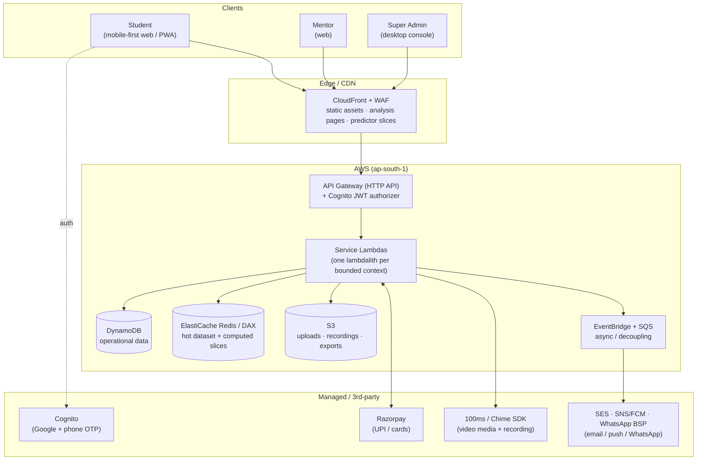

### 3.2 Container / service view

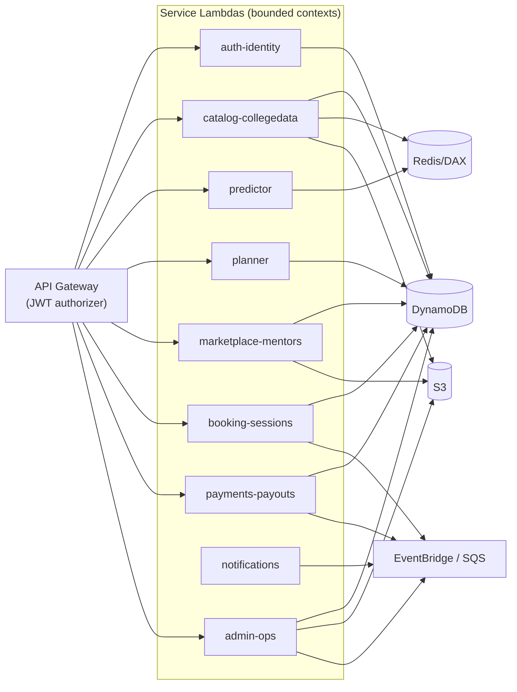

### 3.3 Request lifecycle & the caching ladder
A read climbs down only as far as it must:

```
Client ─▶ CloudFront (edge cache)         ← ~90%+ of Analysis & popular predictor slices stop here
        └▶ API Gateway ─▶ Lambda
                          ├▶ Redis/DAX (hot dataset + computed result slices)  ← most misses stop here
                          └▶ DynamoDB (source of truth)                        ← personalized/uncacheable only
```

### 3.4 Environments & deployment
- **Environments:** `dev` → `staging` → `prod`, isolated AWS accounts (or at minimum isolated stacks), promoted via CI/CD.
- **IaC:** **AWS CDK (TypeScript)** — one app, per-service stacks, per-env config. Reproducible, reviewable, diffable.
- **Deploys:** trunk-based; canary/blue-green on API Gateway + Lambda aliases; automatic rollback on alarm.
- **Regions:** primary `ap-south-1`; DynamoDB **Point-in-Time Recovery** + optional global table to `ap-south-2` for DR; S3 cross-region replication for recordings/exports.

---

## 4. Core services (bounded contexts)

| # | Service | Owns | Hot path? | Store |
|---|---|---|---|---|
| 1 | **auth-identity** | sign-up/in, Google/OTP, JWT, roles (student/mentor/admin), user profile & rank/prefs | yes (login) | Cognito + DynamoDB |
| 2 | **catalog-collegedata** | colleges, branches, offerings, **cutoffs**, analysis content, reviews; admin ingestion & publish | yes (reads) | DynamoDB + Redis + S3 + CDN |
| 3 | **predictor** | rank → Safe/Target/Reach results, filters, home-state quota; result caching | **hottest** | Redis (dataset) + CDN (slices) |
| 4 | **planner** | shortlist, ordered choice list, List Doctor, export/PDF | yes (writes) | DynamoDB + S3 |
| 5 | **marketplace-mentors** | mentor profiles, verification workflow, availability, search | medium | DynamoDB + S3 |
| 6 | **booking-sessions** | booking, scheduling, session lifecycle, video token, recording, ratings | medium | DynamoDB + EventBridge + SFU |
| 7 | **payments-payouts** | checkout, Razorpay, ledger, refunds, mentor payouts | low vol / high value | DynamoDB (ledger) + Razorpay |
| 8 | **notifications** | deadline reminders, booking/mentor updates, broadcasts (in-app/email/push/WhatsApp) | async | EventBridge/SQS + SES/SNS |
| 9 | **admin-ops** | dashboards, verification queue, moderation, CMS, support, data management | low | DynamoDB + Athena |
| (10) | **analytics** | funnel, revenue, cohorts (offline) | batch | DynamoDB Streams → S3 → Athena |

---

## 5. Low-Level Design (LLD) per core service

Each service is a **lambdalith**: one Lambda, a Hono router, a `handlers/` layer (HTTP), a `domain/` layer (business logic — where your `// TODO(owner)` logic lives), and a `repo/` layer (DynamoDB/Redis access). Sequence diagrams show the critical flows.

### 5.1 auth-identity
**Responsibilities:** federate Google + phone OTP via Cognito; issue app JWT; map to roles; store editable rank/category/home-state/prefs (the predictor's inputs).

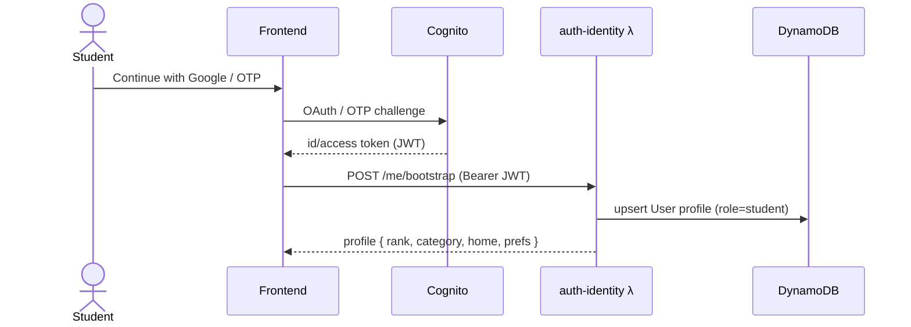
**Key endpoints:** `POST /auth/bootstrap`, `GET/PATCH /me`, `PATCH /me/rank-prefs`, `POST /me/role` (student↔mentor). **Notes:** JWT verified at API Gateway (Cognito authorizer); services trust claims. Rank/pref writes emit `user.profile.updated` (predictor cache is per-input, not per-user, so no invalidation needed — see §7).

### 5.2 catalog-collegedata
**Responsibilities:** master data (colleges, branches, offerings), **cutoffs** (year/round/category/quota/gender-pool → opening/closing rank, seats), analysis content, reviews. Admin **ingests + validates + publishes** a new dataset version per round; publish triggers cache warm + CDN invalidation.

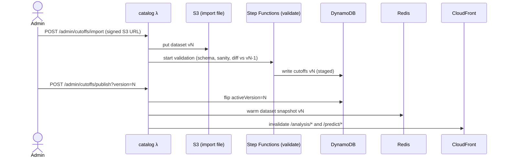
**Key endpoints:** `GET /colleges/:id` (CDN), `GET /colleges/:id/analysis` (CDN, long TTL), admin: `POST /admin/cutoffs/import|validate|publish`, `GET /admin/data/version`, `POST /admin/spot-check`. **Notes:** dataset is **versioned & immutable**; "publish" is an atomic pointer flip → instant rollback. Analysis pages are per-college-branch and identical for all users → CDN with `stale-while-revalidate`.

### 5.3 predictor — *the hottest path*
**Responsibilities:** given `(examRank, category, homeState, filters)` return college-branches bucketed Safe/Target/Reach. **No per-request DB.** The active cutoff snapshot lives in Redis (and warm in Lambda memory); results are computed in-process and cached as **slices** keyed by a normalized input hash, served from CDN.

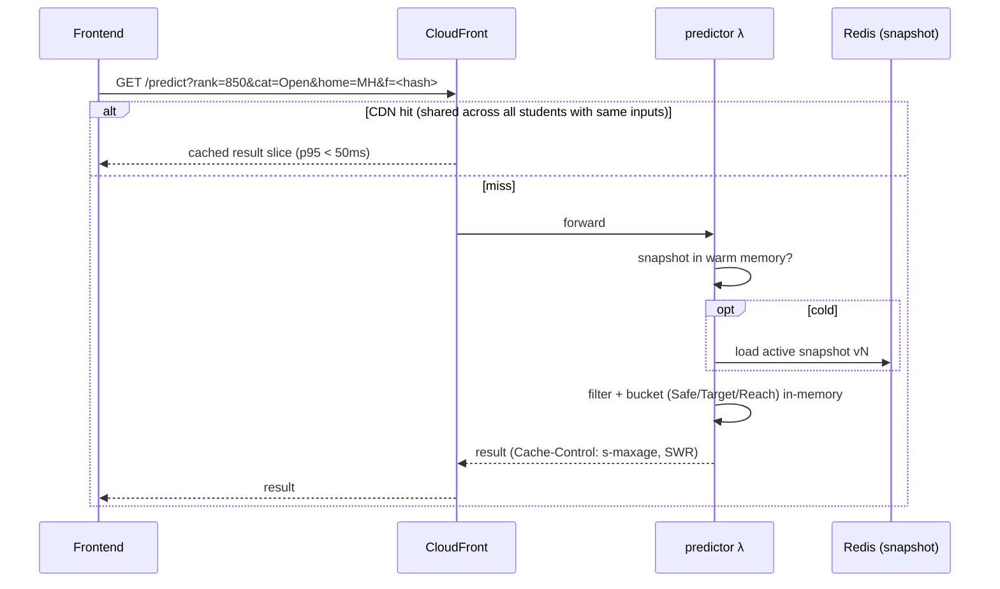
**Why this scales to lakhs:** result slices are **shared** — thousands of students share a rank-bucket + common filters, so cache hit ratio is very high and origin compute is a rounding error. **Compute is pure CPU over a small array**, so cold path is still fast. **Endpoints:** `GET /predict` (cacheable), `GET /predict/summary` (counts). Personalization ("your chance %") is deterministic from inputs, so it stays cacheable.

### 5.4 planner
**Responsibilities:** shortlist + **ordered** choice list (order = JoSAA priority), List Doctor warnings, export to PDF. Per-user, small, write-ish.

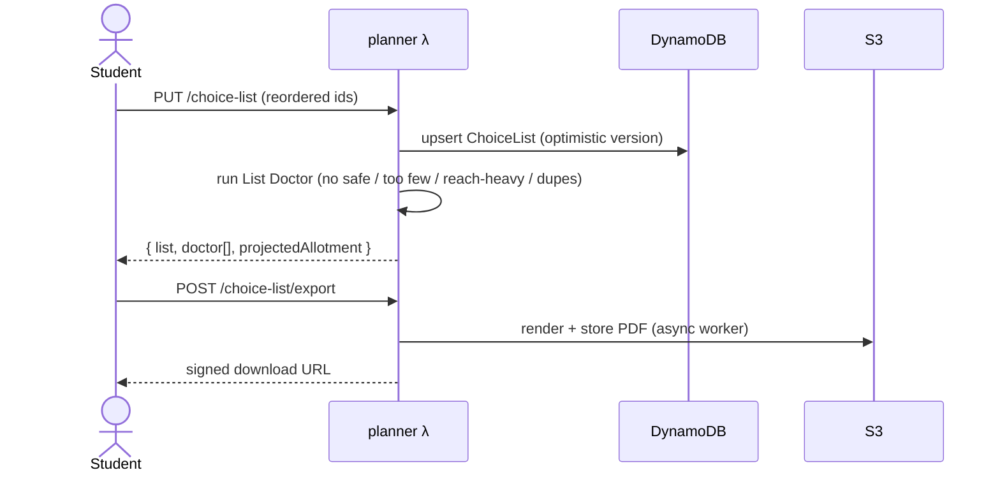
**Endpoints:** `GET/PUT /shortlist`, `GET/PUT /choice-list`, `POST /choice-list/reorder`, `GET /choice-list/doctor`, `POST /choice-list/export`. **Notes:** List Doctor is pure logic over the list + predictor decoration → reuse predictor's `decorate()`. Optimistic concurrency (version attr) to survive double-taps.

### 5.5 marketplace-mentors
**Responsibilities:** mentor profile, **verification workflow** (.ac.in OTP + student-ID upload → pending → approved/rejected), availability slots, search/filter.

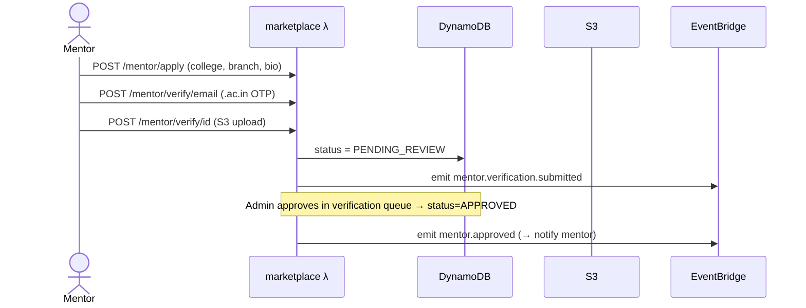
**Endpoints:** `POST /mentor/apply`, `POST /mentor/verify/email|id`, `GET/PUT /mentor/profile`, `GET/PUT /mentor/availability`, `GET /mentors` (search: college/branch/topic/price/rating/soonest). **Notes:** locked fields (college/branch/year) become immutable post-approval. Search over a few-thousand-row set → DynamoDB GSIs (or in-memory filter of a cached mentor index).

### 5.6 booking-sessions
**Responsibilities:** slot booking, session lifecycle (`booked → live → ended → rated`), video **join token** (SFU), recording capture, ratings. This is where **booking + payment form a saga**.

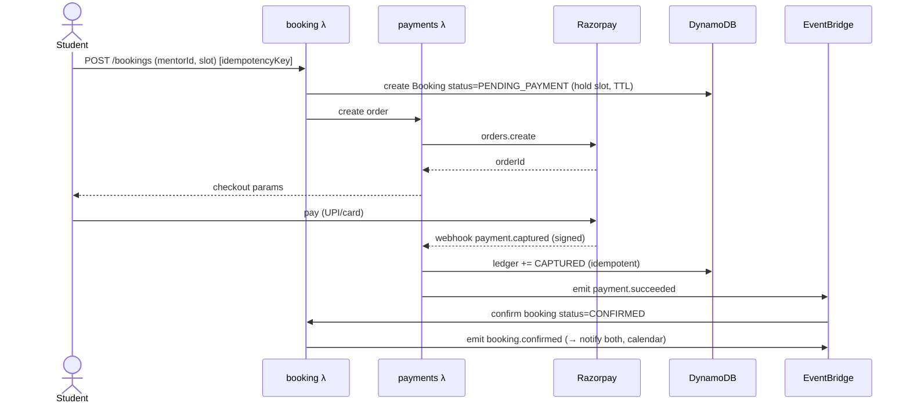
Join + recording:
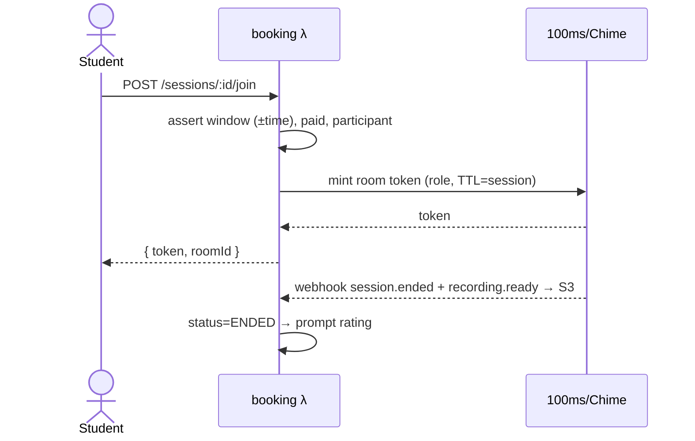
**Endpoints:** `POST /bookings`, `POST /bookings/:id/cancel`, `GET /sessions`, `POST /sessions/:id/join`, `POST /sessions/:id/rate`, webhooks `/webhooks/sfu`. **Notes:** slot hold via DynamoDB conditional write + TTL to auto-release unpaid holds; **idempotency keys** on booking + payment; refund on mentor no-show (auto-trigger).

### 5.7 payments-payouts
**Responsibilities:** Razorpay orders, signed webhook verification, an **append-only ledger**, refunds, mentor payout batches (₹80 of ₹100 after 20% fee). Correctness > everything.

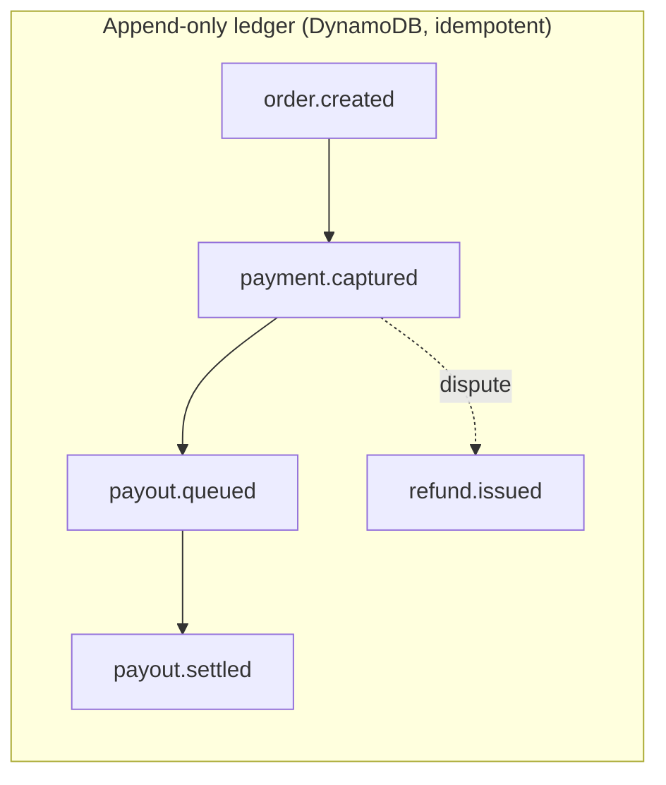
**Endpoints:** `POST /payments/order`, `POST /webhooks/razorpay` (signature-verified), `POST /refunds`, admin `GET /payouts/queue`, `POST /payouts/process`. **Notes:** every write keyed by provider event id → **exactly-once**. Money truth = ledger; balances are folds over the ledger. Reconciliation job (daily) diffs ledger vs Razorpay settlement report. *(Payments code is boilerplate + interfaces only; secrets in Secrets Manager; PCI scope minimized — card data never touches us.)*

### 5.8 notifications
**Responsibilities:** consume domain events → fan out to channels (in-app, email/SES, push/FCM, WhatsApp BSP); scheduled **deadline reminders** off the counselling calendar; admin **broadcasts** (segment + template).

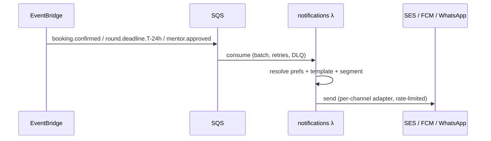
**Notes:** SQS decouples spikes; DLQ + replay; per-user channel prefs; broadcast targeting (all / by state / by round) with scheduled sends (EventBridge Scheduler).

### 5.9 admin-ops
**Responsibilities:** platform dashboards, **mentor verification queue** (the trust gate), moderation (trust & safety — extra care, minors), CMS, support tickets, data-management triggers (delegates to catalog). Desktop, low volume, high privilege.
**Notes:** all admin actions **audited** (append-only audit log); RBAC via a dedicated `admin` group with fine-grained action scopes; dashboards read from **materialized rollups** (DynamoDB Streams → aggregates), never scanning live tables.

---

## 6. Data model

**Primary store: DynamoDB.** Rationale: scales to zero (seasonal), scales to lakhs (on-demand), no connection layer, single-digit-ms reads with DAX. We model **per-service tables** (clear ownership, independent scaling) rather than one giant single-table — simpler to reason about and to hand `// TODO` repos to you.

### 6.1 Tables & primary access patterns (sketch)
| Table | PK / SK | Key GSIs | Access patterns |
|---|---|---|---|
| `Users` | `PK=USER#<id>` / `SK=PROFILE` | `GSI1: email`, `GSI2: phone` | get/update profile, lookup by email/phone |
| `Colleges` | `PK=COLLEGE#<id>` / `SK=META` \| `BRANCH#<b>` | `GSI1: type`, `GSI2: state` | college + its branches, browse by type/state |
| `Cutoffs` | `PK=CUTOFF#<version>` / `SK=<collegeBranch>#<cat>#<quota>#<pool>` | — | bulk-load snapshot per active version |
| `Content` | `PK=COLLEGE#<id>` / `SK=ANALYSIS` \| `REVIEW#<id>` | — | analysis page, reviews |
| `Planner` | `PK=USER#<id>` / `SK=SHORTLIST` \| `CHOICELIST` | — | get/put per-user lists |
| `Mentors` | `PK=MENTOR#<id>` / `SK=PROFILE` \| `AVAIL#<slot>` | `GSI1: status`, `GSI2: college#topic`, `GSI3: soonestSlot` | search, availability, verification queue |
| `Bookings` | `PK=BOOKING#<id>` / `SK=META` | `GSI1: USER#<id>`, `GSI2: MENTOR#<id>`, `GSI3: status#time` | my sessions, mentor's sessions, monitor |
| `Ledger` | `PK=ACCT#<id>` / `SK=EVT#<ts>#<providerEvtId>` | `GSI1: providerEvtId (idempotency)` | append event, fold balance, reconcile |
| `Notifications` | `PK=USER#<id>` / `SK=NOTIF#<ts>` | `GSI1: unread` | feed, mark read |
| `Audit` | `PK=ADMIN#<id>` / `SK=ACT#<ts>` | `GSI1: entity` | admin action trail |

> Full attribute-level schemas + every access pattern live in each service's `docs/` when we build it. **Streams** on `Bookings`/`Ledger`/`Users` → EventBridge and analytics rollups. **PITR** on all tables; **TTL** on `PENDING_PAYMENT` holds and ephemeral OTPs.

### 6.2 Where cutoffs actually live at runtime
The active cutoff **snapshot** (immutable, per published version) is serialized once and cached in **Redis** + warmed into Lambda memory. The predictor reads this snapshot, **never DynamoDB per request.** DynamoDB is the durable system-of-record for authoring/versioning; Redis+CDN serve the reads.

### 6.3 Optional SQL (open decision — §15)
For **financial reconciliation + admin analytics**, ad-hoc SQL is nicer than DynamoDB. Two paths:
- **A (recommended start):** DynamoDB-only; stream to **S3 + Athena** for analytics; keep the ledger disciplined. **Scales to zero, cheapest, simplest.**
- **B:** add **Aurora Serverless v2 (Postgres)** behind RDS Proxy as system-of-record for payments/reporting. Better SQL, but min-ACU cost + ops. *Add only if analytics demand it.*

---

## 7. Caching strategy (the thing that makes lakhs cheap)

Three layers, each with a clear invalidation story:

1. **CloudFront (edge)** — static assets; **College Analysis JSON/HTML** (long TTL, per college-branch, identical for all); **predictor result slices** (`s-maxage` + `stale-while-revalidate`, keyed by normalized inputs). Invalidated **only** on `cutoffs.publish` (per round, a handful of times a season).
2. **Redis / DAX (regional)** — the **cutoff snapshot** (the dataset the predictor computes over); computed hot slices; the mentor search index. Warmed at publish time.
3. **Lambda memory (in-process)** — snapshot kept across warm invocations → zero network on the common path.

**Cache keys & normalization:** predictor inputs are normalized (rank→bucket where safe, sorted filter set → stable hash) so **many students collapse onto one cache entry** → very high hit ratio. **Personalization stays cacheable** because "your chance %" is a pure function of inputs, not identity.

**Invalidation model:** dataset is **immutable + versioned**; publish is an **atomic pointer flip** (`activeVersion=N`) + a single CDN invalidation of `/analysis/*` and `/predict/*`. Rollback = flip back. No fine-grained cache busting, no stampede (SWR serves stale while one request revalidates).

---

## 8. Scaling to lakhs — capacity, levers, seasonal ops

### 8.1 Why the numbers work
- **Reads dominate and are shared** → CDN absorbs ~90%+. Origin sees a small fraction.
- **Predictor is CPU-over-a-small-array**, no DB, so even misses are cheap and horizontally infinite on Lambda.
- **Writes are small & per-user** (choice list, booking) → DynamoDB on-demand eats spikes.
- **Transactions are low-volume** → never the bottleneck.

### 8.2 Levers (in priority order)
1. **Cache hit ratio** — the master dial. Monitor it; a drop is the earliest scaling signal.
2. **Provisioned concurrency** on `predictor`, `auth`, `planner` — **scheduled** for Jun–Jul, and **pre-warmed before known spikes** (round-result timestamps are published — we scale *ahead* of them).
3. **DynamoDB on-demand** (or provisioned + auto-scaling with a reserved floor for baseline).
4. **SQS load-leveling** for booking/payment/notification bursts → smooth, retryable, DLQ-protected.
5. **Reserved concurrency** to protect critical functions from noisy-neighbor starvation.
6. **WAF rate limits + bot/CAPTCHA at signup** to shed abusive load.

### 8.3 Graceful degradation (fail soft, never dark)
If payments or video are down, **Predict + Plan still work** (the core value). Circuit breakers around Razorpay/SFU; feature flags to disable non-core features under stress; friendly "try again" states (the frontend already has them).

### 8.4 Seasonal automation
EventBridge-scheduled jobs: **ramp up** provisioned concurrency + alarms + on-call the week before the window; **ramp down** to near-zero after. A `season: on|off` config flag gates the expensive knobs.

### 8.5 Load testing (Phase 9)
k6/Artillery replaying a **round-result spike** to 5k rps predictor + realistic write mix; verify SLOs, cache ratios, DynamoDB throttles, cold-start p99, and cost per 100k requests **before** the season.

---

## 9. Security, privacy & safety (many users are minors)

- **AuthN:** Cognito (Google + phone OTP); short-lived JWT; refresh rotation. **AuthZ:** role claims (student/mentor/admin) + per-endpoint scopes; admin actions audited.
- **PII minimization:** store the least (rank, category, state, contact). Encrypt at rest (KMS) & in transit (TLS). Field-level encryption for sensitive IDs.
- **Payments:** card data never touches us (Razorpay-hosted); webhooks **signature-verified**; secrets in **Secrets Manager**; least-privilege IAM per function.
- **Trust & Safety:** mentor verification is the gate; **session recording** for safety (consented, access-controlled, retention-limited in S3); moderation queue; report/flag everywhere; special care for minors (guardianship copy, limited data sharing, no public exposure of student PII).
- **Abuse:** WAF, API Gateway throttling, CAPTCHA at signup, per-user rate limits.
- **Compliance posture:** align to India DPDP Act (consent, data-retention, deletion requests); document a data-retention & deletion policy (recordings, IDs).

---

## 10. Observability & operations

- **Logs:** structured JSON (request id, user id hash, service, latency) → CloudWatch Logs; **traces:** X-Ray across API GW → Lambda → DynamoDB/Redis.
- **Metrics & dashboards:** RED per service (Rate/Errors/Duration), **cache hit ratio**, DynamoDB throttles, Lambda cold-start p99, Razorpay/SFU webhook lag, SQS depth/DLQ.
- **Alarms → on-call** (in-season): SLO burn, error spikes, DLQ non-empty, payment reconciliation mismatch, cache-ratio drop.
- **Runbooks:** publish-a-new-round, spike-response, payment-reconciliation, refund, incident. **DR:** PITR restore drill; region-failover plan; RPO/RTO stated per data class.

---

## 11. Cost model (seasonal, scale-to-zero)

- **Off-season (~10 mo):** Lambda idle = ₹0; DynamoDB on-demand idle ≈ storage only; no EC2/idle Aurora (if we choose path A). CloudFront/S3 minimal. → **near-zero fixed cost**, the whole point.
- **In-season:** dominated by (a) CloudFront egress, (b) provisioned concurrency, (c) DynamoDB requests, (d) **video minutes** (the biggest variable — model per-minute SFU cost × concurrent minutes), (e) SMS/WhatsApp. Track **cost per 100k predictor requests** and **cost per paid session** as unit economics.
- **Guardrails:** budgets + anomaly alerts; per-service cost allocation tags; kill-switches on runaway async.

---

## 12. Tech stack & repository structure

**Stack:** TypeScript · Node 20 (ARM64) · **Hono** on Lambda · **AWS CDK** (IaC) · DynamoDB · ElastiCache Redis/DAX · CloudFront · Cognito · EventBridge/SQS/Step Functions · Razorpay · 100ms/Chime · SES/SNS/FCM/WhatsApp · Vitest (unit) · esbuild (bundle) · pnpm + Turborepo (monorepo).

```
forTheStudents/                     # monorepo root
├─ student-counselor/               # existing Next.js frontend
└─ backend/
   ├─ docs/                         # architecture.md, progress.md, ADRs
   ├─ infra/                        # AWS CDK app (per-service stacks, per-env)
   ├─ packages/
   │  ├─ shared/                    # types, DTOs, errors, logger, DDB/Redis clients, auth utils
   │  └─ config/                    # env + feature flags
   └─ services/
      ├─ auth-identity/
      ├─ catalog-collegedata/
      ├─ predictor/
      ├─ planner/
      ├─ marketplace-mentors/
      ├─ booking-sessions/
      ├─ payments-payouts/
      ├─ notifications/
      └─ admin-ops/
```
Each service: `src/handlers/` (HTTP), `src/domain/` (**your `// TODO(owner)` logic**), `src/repo/` (data), `src/events/` (pub/sub), `test/`, `README.md` (endpoints + access patterns + env).

---

## 13. Phase-wise build plan

> Each phase ships independently, has **acceptance criteria**, and updates `progress.md`. Boilerplate-first: we scaffold interfaces + `// TODO(owner)` markers; you fill business logic.

| Phase | Name | Scope | Acceptance criteria |
|---|---|---|---|
| **0** | **Foundations** | Monorepo, CDK bootstrap, shared libs (logger/errors/clients), CI/CD, envs, LocalStack dev, observability baseline | `cdk deploy` to `dev` works; hello-world Lambda behind API GW + JWT stub; pipeline green |
| **1** | **Auth & Identity** | Cognito (Google + OTP), JWT authorizer, user profile + rank/prefs, roles | login → JWT → `/me` CRUD; role switch; e2e auth test |
| **2** | **Catalog + Predictor** *(CORE)* | College/branch/cutoff model, admin ingest+publish (versioned), predictor compute, Redis snapshot, CDN caching, Analysis pages | publish v1; `/predict` returns Safe/Target/Reach; cache hit measured; Analysis served from CDN |
| **3** | **Planner** *(CORE)* | Shortlist, ordered choice list, List Doctor, export/PDF | reorder persists; doctor warnings correct; PDF export |
| **4** | **Marketplace & Mentors** | Mentor apply, .ac.in OTP + ID verify, profile, availability, search | apply → pending; search/filter; availability slots |
| **5** | **Booking, Payments & Sessions** *(CORE)* | Booking saga, Razorpay, ledger, refunds, video token, recording, ratings | book→pay→confirm→join→rate happy path; idempotent; refund on no-show |
| **6** | **Notifications & Timeline** | Event consumers, deadline reminders, booking updates, broadcasts, counselling calendar | reminder fires T-24h; booking confirm notifies; admin broadcast to segment |
| **7** | **Admin & Ops** | Dashboards, verification queue, moderation, CMS, support, audit | approve/reject mentor; moderate; audit trail; rollup dashboards |
| **8** | **Analytics & Reporting** | Streams → S3 → Athena; funnel, revenue, cohorts | funnel + revenue reports queryable |
| **9** | **Hardening & Scale** | Provisioned concurrency schedules, WAF, rate limits, load test to 5k rps, runbooks, DR drill, cost guardrails | SLOs met under load test; runbooks + alarms live |
| **10** | **Go-live & Seasonal Ops** | Canary/blue-green, seasonal ramp automation, on-call, pre-season checklist | prod canary + rollback proven; season on/off automation verified |

**Dependency order:** 0 → 1 → 2 → 3 → 4 → 5 → 6 → 7 → 8, with 9–10 spanning the tail. Phases 2/3/5 are the CORE (match the frontend's CORE screens).

---

## 14. API surface (high-level; full OpenAPI per service at build time)

```
auth-identity        POST /auth/bootstrap · GET|PATCH /me · PATCH /me/rank-prefs · POST /me/role
catalog-collegedata  GET /colleges/:id · GET /colleges/:id/analysis · GET /colleges/:id/reviews
                     [admin] POST /admin/cutoffs/import|validate|publish · GET /admin/data/version
predictor            GET /predict · GET /predict/summary
planner              GET|PUT /shortlist · GET|PUT /choice-list · GET /choice-list/doctor · POST /choice-list/export
marketplace-mentors  POST /mentor/apply · POST /mentor/verify/email|id · GET|PUT /mentor/profile
                     GET|PUT /mentor/availability · GET /mentors
booking-sessions     POST /bookings · POST /bookings/:id/cancel · GET /sessions
                     POST /sessions/:id/join · POST /sessions/:id/rate · POST /webhooks/sfu
payments-payouts     POST /payments/order · POST /webhooks/razorpay · POST /refunds
                     [admin] GET /payouts/queue · POST /payouts/process
notifications        GET /notifications · POST /notifications/read · [admin] POST /broadcasts
admin-ops            GET /admin/dashboard · GET /admin/verify-queue · POST /admin/verify/:id/(approve|reject)
                     GET /admin/moderation · POST /admin/support/* · GET /admin/audit
```

---

## 15. Open decisions (need your call before/with approval)

1. **DB path:** (A) **DynamoDB-only + Athena** *(recommended: scales to zero, cheapest)* vs (B) add **Aurora Serverless v2** for SQL analytics/ledger. → *Default: A.*
2. **Video provider:** **100ms** *(recommended: Indian, low India latency, good pricing)* vs **Amazon Chime SDK** *(all-AWS, tighter IAM)* vs Twilio/Agora. → *Default: 100ms.*
3. **IaC:** **AWS CDK (TS)** *(recommended)* vs **SST** *(best DX)* vs Serverless Framework vs Terraform. → *Default: CDK.*
4. **API composition:** **lambdalith per service (Hono)** *(recommended: fewer cold starts)* vs nano-lambda per route. → *Default: lambdalith.*
5. **Payments gateway:** **Razorpay** *(recommended: UPI-first, India)* vs Cashfree/PhonePe PG. → *Default: Razorpay.*
6. **Auth:** **Cognito** *(recommended: managed Google+OTP)* vs Auth0/Clerk vs custom. → *Default: Cognito.*
7. **Monorepo home:** put `backend/` beside `student-counselor/` in one repo *(recommended)* vs separate repo. → *Default: same repo.*

> When you approve (and pick/override the defaults above), I'll scaffold **Phase 0 + Phase 1 boilerplate** with `// TODO(owner)` markers and per-endpoint input/output docs — nothing more until you review each phase.
